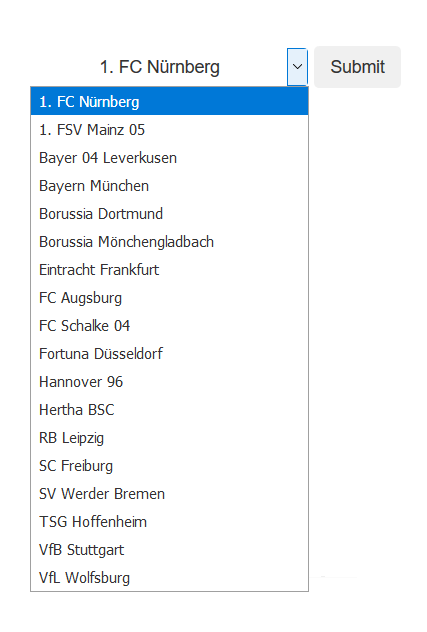
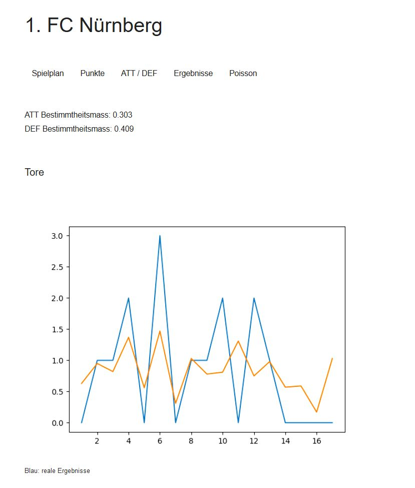

##  Football

This small project can import football results and visualize them in flask

It was created to learn flask, web crawling, data processing and data visualization  


### Features

- flask generate an interactive GUI environment
- extract the soccer results from the official dfb-website
- format and save the data in CSV-files automatically
- get the season overview 
- create dynamic data diagrams
- calculate the attack/defence value of each club and try to predict the results (based on poisson)
- compare the predicted and real results by using the coefficient of determination (R²)

------------
------------
------------

### First Steps: 

</br>

#### Import the results

- Open ```main.py``` and choose the url for a league

- run:
```
GET_ALL(url)
```

- results will automatically save in a CSV-file (folder: CSV)

</br>

#### Select a data source 

- open ```main.py``` and select the csv file you want to work with

------------
------------
------------

### GUI

- start ```START_Gui.py``` (default IP: 127.0.0.1:5000)

- choose a club in the dropdown menu



- you can switch between the options and analyse the data


</br>

------------

#### Example:




