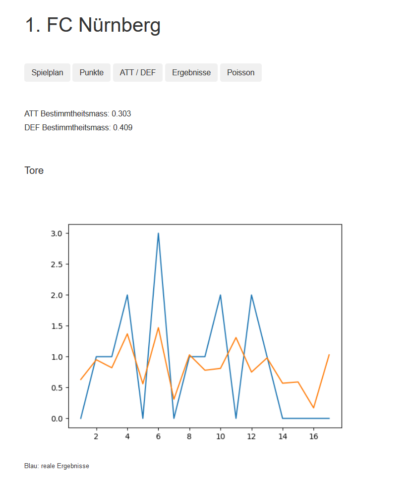

##  Football

This project can import football results and visualize them in flask

It was created to learn flask, web crawling, data processing and data visualization  


### Features

- crawl the soccer results from the official dfb-website and save them in csv-files
- get the season overview 
- create a point diagram
- calculate the ATT/DEF value and try to predict the results (based on poisson)
- compare the predict results and real results by using the coefficient of determination

------------
------------
------------

### First Steps: 

#### Import the results

- Open ```main.py``` and choose the url for a league

- run:
```
GET_ALL(url)
```

- The results will automatically saved in a csv-file (folder: CSV)

#### Choose the data source 

- Open ```main.py``` and choose the csv file you want to work with

------------
------------
------------

### flask server: 

- Start: ```START_Gui.py``` (Default IP: 127.0.0.1:5000)

- Choose a club in the dropdown menu

- Now you can switch between the options and analyse the data

------------

#### Example:




